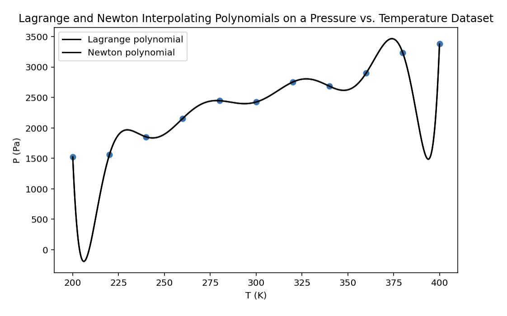
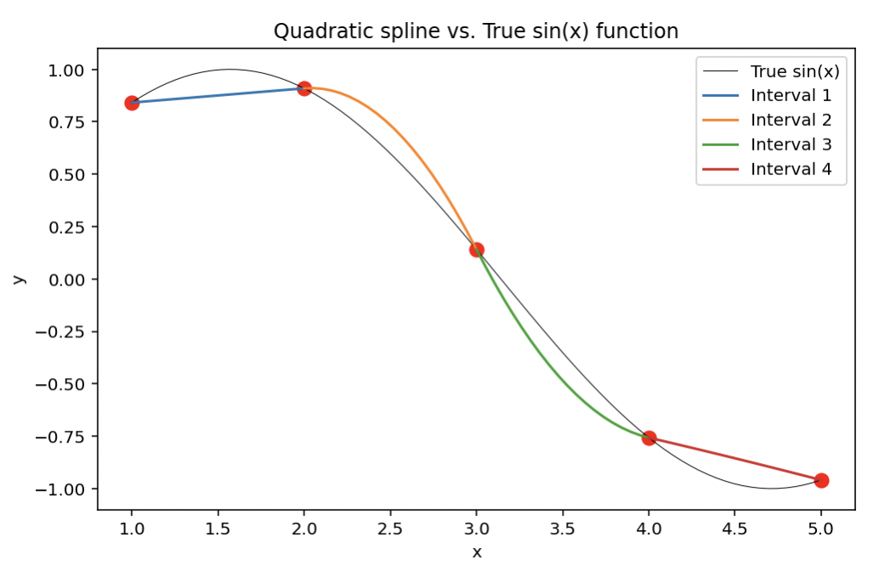
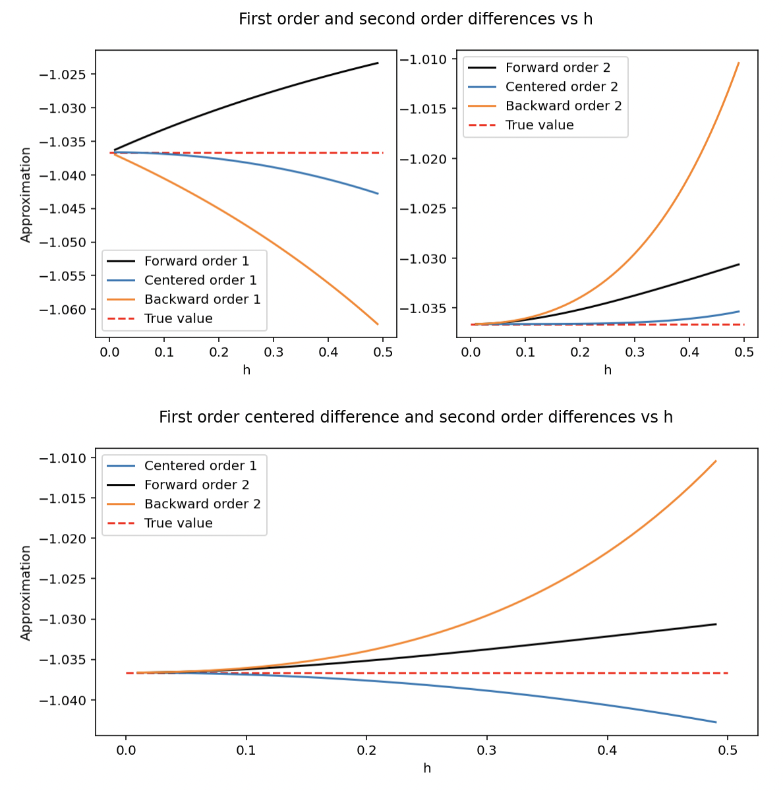
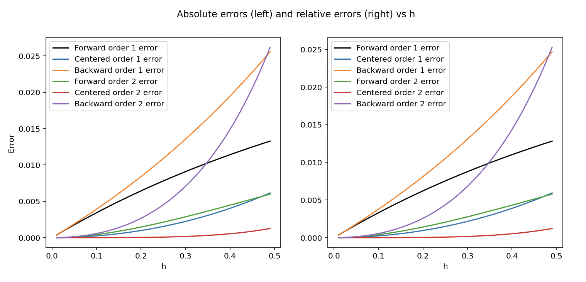
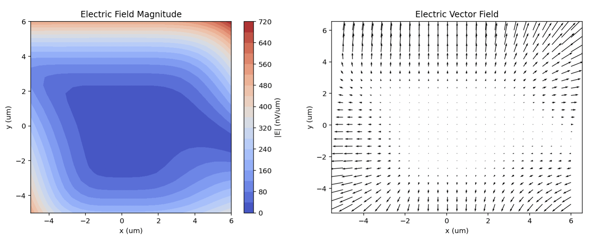
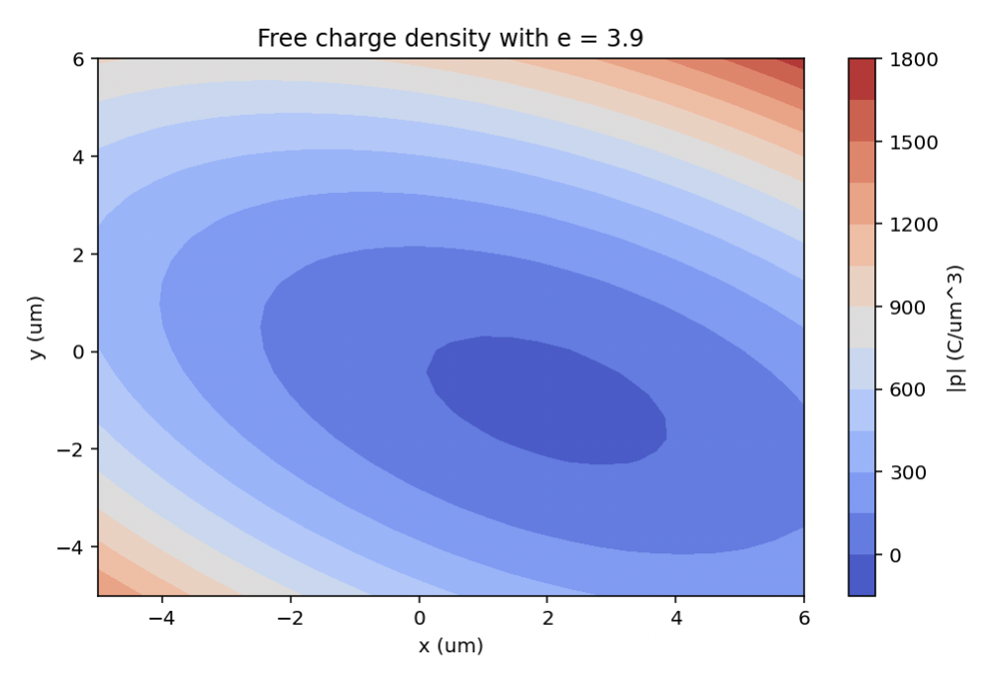

# Antony Awad - Some Visualizations from Coursework
A portfolio of some of my data visualizations and projects from computer science and engineering classes. Click on each project name to go see the underlying code.

## Visualizations from Computational Methods in Engineering
### [Various Interpolating Polynomial Methods](https://github.com/antony-git/antony-git/blob/main/Engineering/Computational_methods.py)

The difference is actually indistinguishable for these polynomials of order N = 11.

A quadratic spline interpolation (these spline functions are actually used to draw the curves on fonts like Times New Roman).

### [1st and 2nd Order Difference Approximations and their Errors](https://github.com/antony-git/antony-git/blob/main/Engineering/Computational_methods.py)

### [Contour Plots of Electric Field and Free Charge Density](https://github.com/antony-git/antony-git/blob/main/Engineering/Computational_methods.py)

## Group Project: [Football Game Simulator and Web Scraper (ACJR-project)](https://github.com/antony-git/antony-git/tree/main/acjr-project-master-421b28c945b266cd97de1031bc8043d81ff8a86c)
(Antony Awad, Cooper Powell, Johann Hatzius, Robert Gillespie): This project contains the files needed to crawl, scrape, and analyze data from pro-football-reference.com and profootballarchives.com. This data is used to help simulate a football game between any two NFL teams within the past 11 seasons (dating back to the 2010-2011 season). This data is presented in the format of a django website. 
- The purpose of this project is to determine which of two teams would win an NFL game if they had the optimal play called for them in each situation throughout the game. We used past NFL data to figure out what each team's best offensive play type would be against the other team chosen for the simulation, then used random outcomes from when those plays were called for the offense or against the defense in real life. 
- The django website displays our approximation of how a game would play out between the two given teams if they called the plays that are most likely to score them points each drive down the field.
